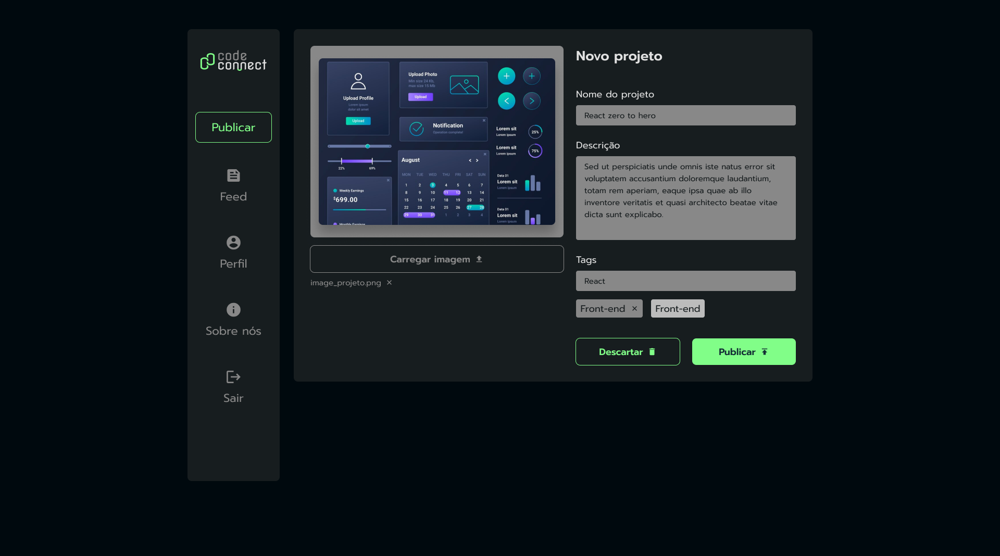

# Titulo do projeto
## Code Connect

Projeto de upload de arquivos com HTML, CSS e JavaScript, explorando programação assíncrona.

## 🔨 Funcionalidades do projeto

Durante o curso, desenvolvemos a página de upload de arquivos do CodeConnect, aplicando conceitos de programação assíncrona, manipulação do DOM e boas práticas de desenvolvimento web. O projeto permite que os usuários carreguem imagens, adicionem descrições, insiram tags e publiquem as informações com feedback visual.



## 🛠️ Tecnologias utilizadas

- **HTML**
- **CSS**
- **JavaScript**
  - Promises
  - Async/Await
  - Try/Catch
  - SetTimeout
  - Manipulação do DOM (seletores, eventos e funções)

## 🚀 Como executar o projeto

### 📌 Pré-requisitos

- Navegador web atualizado
- Editor de código (opcional, recomendado: VS Code)

### 📂 Clonando o repositório

```bash
  git clone https://github.com/seu-usuario/codeconnect-upload.git
  cd codeconnect-upload
```

### ▶️ Executando o projeto

1. Abra o arquivo `index.html` no navegador
2. Clique no botão **"Carregar Imagem"**
3. Escolha uma imagem específica
4. Defina o **"Nome do projeto"**, como por exemplo: `Portfólio do gato`
5. Preencha a **descrição** com informações sobre o projeto (ex.: `Para este projeto foram usados HTML, CSS e JavaScript`)
6. Adicione algumas **tags** no campo designado, como `Front-end, JavaScript, Fullstack, Programação`, para servir como palavras-chave do projeto
   - Pressione **Enter** para adicionar cada nova tag à lista
7. Opções disponíveis:
   - **"Descarte"** para cancelar as informações
   - **"Publicar"** para confirmar os dados
   - Após clicar em **"Publicar"**, um alerta exibirá o feedback da ação realizada.